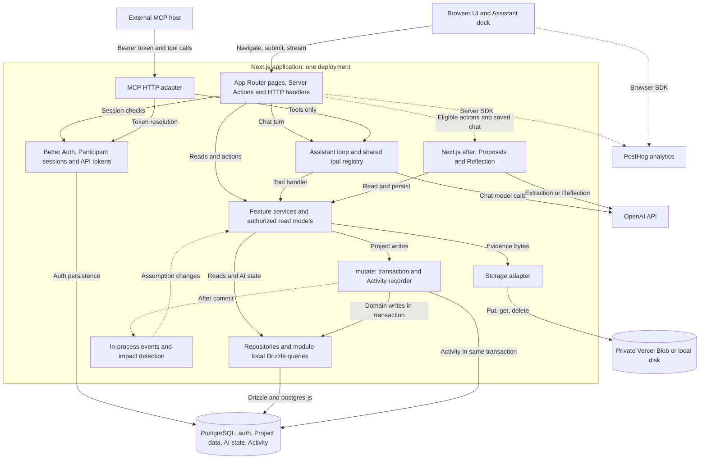
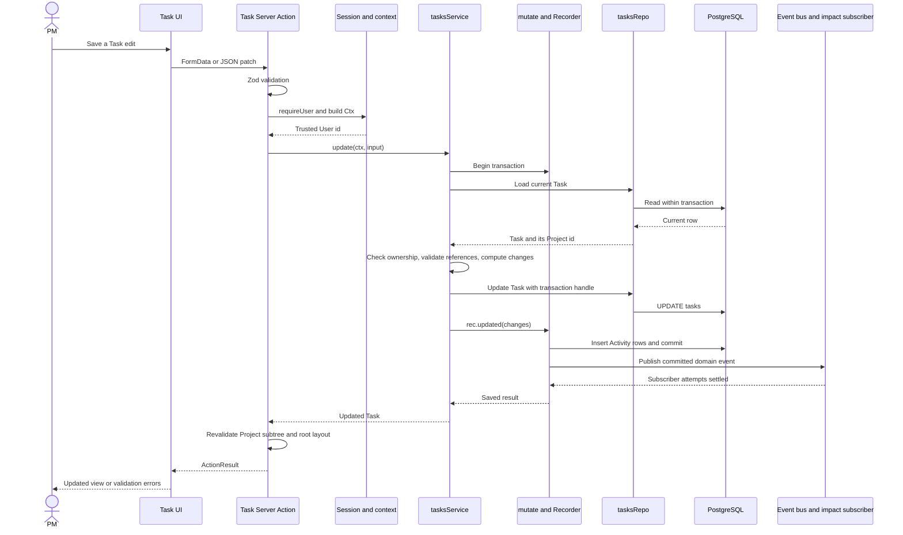
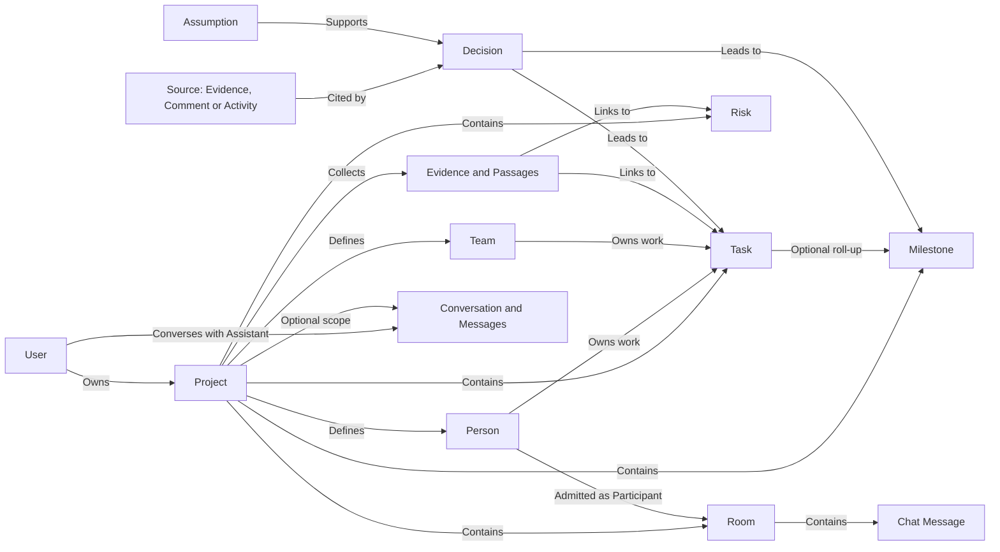
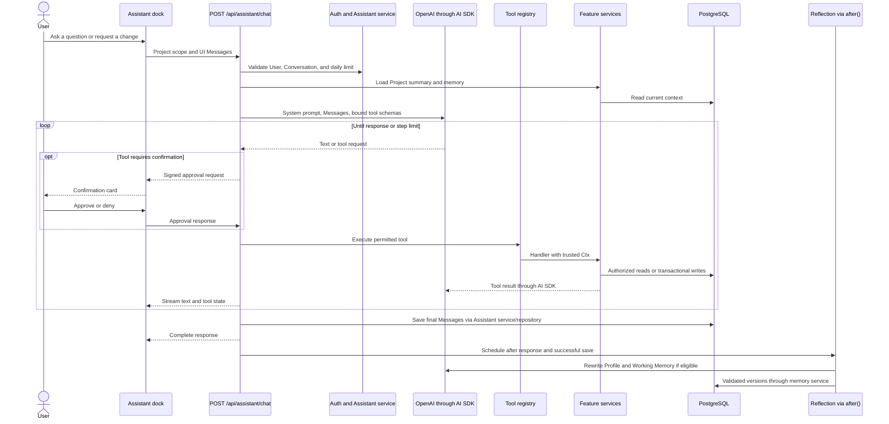
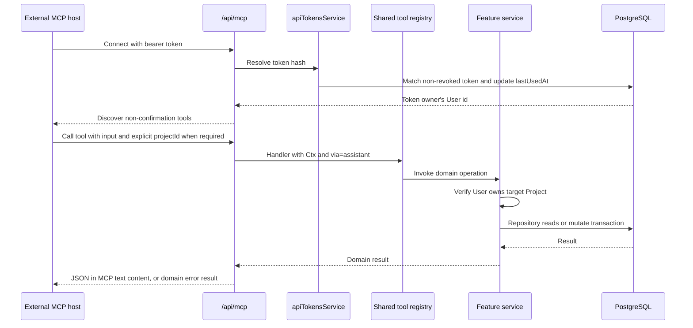
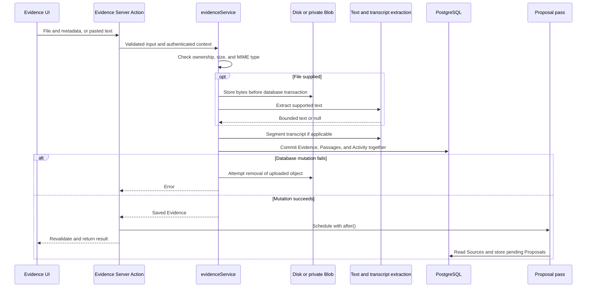

# PrismPM architecture

PrismPM is a modular Next.js application for managing Projects and preserving the reasoning behind Decisions.
The browser UI, in-app Assistant, and external MCP clients share the same server-side business operations and PostgreSQL data.
This document describes the implementation at main commit `5880bc9`, audited on 21 September 2026, including the public landing page and the current Participant messaging surface.
It describes the deployment configuration in the repository, not a verified inventory of a live production environment.

Use this guide for the complete system map and request boundaries.
Use the [domain glossary](../CONTEXT.md) for terminology, [developer onboarding](developer-onboarding.md) for setup, [AI system guide](ai-system-guide.md) for AI details, and [ADRs](adr/) for design rationale.

## Contents

- [Complete system map](#complete-system-map)
- [Runtime and code boundaries](#runtime-and-code-boundaries)
- [Routes and UI](#routes-and-ui)
- [Authentication and authorization](#authentication-and-authorization)
- [Read and write flows](#read-and-write-flows)
- [PostgreSQL and the domain model](#postgresql-and-the-domain-model)
- [AI and MCP](#ai-and-mcp)
- [Evidence and storage](#evidence-and-storage)
- [Events and consistency](#events-and-consistency)
- [Analytics](#analytics)
- [Deployment and configuration](#deployment-and-configuration)
- [Verification and change guide](#verification-and-change-guide)
- [Current limits](#current-limits)

## Complete system map

The boxes inside the Next.js application are code boundaries within one application, not independently deployed services.
Solid arrows show calls or data access; dotted arrows show telemetry, post-response work, or post-commit events.
The principal UI write path is **UI -> Server Action -> service -> repository/Drizzle -> PostgreSQL**.
Server-rendered reads skip the Server Action and call a service or authorized read model directly.

The auth-to-database arrow represents the Better Auth Drizzle adapter and the separate Participant/API-token modules.
Session persistence, API-token management, and Participant self-service credential changes do not use Project mutation recording.
PM-issued invitations are an exception: issuing or reissuing one records a Person Activity Event through `mutate`.
The AI box combines the shared registry with the in-app loop for readability; MCP calls the registry only and never invokes that loop.
The Evidence download handler also calls the Evidence service and storage adapter after authenticating the User.
The diagram groups these internal helpers to keep the main boundaries visible.

Source entry points: [pages](../src/app/), [action wrappers](../src/server/core/action.ts), [mutation core](../src/server/core/mutation.ts), [database client](../src/server/db/client.ts), [storage](../src/server/storage/index.ts), [chat route](../src/app/api/assistant/chat/route.ts), [MCP route](../src/app/api/mcp/route.ts), and [analytics](../src/shared/analytics/).

## Runtime and code boundaries

The stack is Next.js 16 App Router, React 19, TypeScript, Tailwind CSS 4, Drizzle ORM, and PostgreSQL.
The server uses Node APIs for hashing, file handling, database access, and extraction.
There is no separate backend HTTP service between Server Components and the domain modules.
The AI SDK supplies streaming and tool execution; Better Auth supplies PM account authentication.
Installed versions are recorded in [package.json](../package.json) and [package-lock.json](../package-lock.json).

| Boundary                      | Responsibility                                                                    | Representative code                                                                                           |
| ----------------------------- | --------------------------------------------------------------------------------- | ------------------------------------------------------------------------------------------------------------- |
| `src/app`                     | Routes, layouts, server-rendered data loading, HTTP handlers                      | [App routes](../src/app/)                                                                                     |
| `src/widgets`                 | Composed application UI: shell, Timeline, Calendar, Assistant                     | [Widgets](../src/widgets/)                                                                                    |
| `src/features`                | Interactive views and forms that call Server Actions                              | [Task dialog](../src/features/task/task-dialog.tsx)                                                           |
| `src/entities`                | Domain display components, such as badges and Activity rows                       | [Entities](../src/entities/)                                                                                  |
| `src/shared`                  | UI primitives, design tokens, fixed vocabulary, utilities, analytics adapters     | [Domain vocabulary](../src/shared/domain/index.ts)                                                            |
| `actions.ts`                  | Parse input, resolve authenticated context, call a service, revalidate UI         | [Task actions](../src/server/modules/tasks/actions.ts)                                                        |
| `service.ts`                  | Authorize, enforce domain rules, coordinate transactions and modules              | [Task service](../src/server/modules/tasks/service.ts)                                                        |
| `repository.ts`               | Database queries using either `Db` or transaction-scoped `Tx`                     | [Task repository](../src/server/modules/tasks/repository.ts)                                                  |
| `schema.ts` / `validation.ts` | Drizzle table definitions / Zod input contracts                                   | [Task schema](../src/server/modules/tasks/schema.ts), [validation](../src/server/modules/tasks/validation.ts) |
| `src/server/core`             | Context, errors, validation wrappers, mutation recording, numbering, invalidation | [Core](../src/server/core/)                                                                                   |

These are responsibility boundaries rather than a requirement that every call pass through every UI directory.
UI code never imports repositories.
Some small modules keep SQL alongside their services, including Labels, Activity, and API tokens; Task search also contains its authorized query locally.
Those are existing variations of the persistence boundary, not evidence of a second application backend.
Design tokens and visual conventions live in [DESIGN.md](../DESIGN.md) and [globals.css](../src/app/globals.css).

## Routes and UI

On this version of main, `/` is a public landing page for both anonymous and signed-in visitors.
The workspace dashboard is `/dashboard`.
PM login defaults to `/dashboard`, or a valid same-origin absolute path supplied through `next`.
The proxy redirects based on cookie presence only; layouts and services perform the real checks.

| Surface            | Route                                                      | Data and behavior                                                                                                                            |
| ------------------ | ---------------------------------------------------------- | -------------------------------------------------------------------------------------------------------------------------------------------- |
| Marketing          | `/`                                                        | Public product page                                                                                                                          |
| PM authentication  | `/login`, `/signup`                                        | Better Auth email/password forms                                                                                                             |
| Dashboard          | `/dashboard`                                               | Active/on-hold Projects, attention counts and items, unfinished Milestones due by the 14-day horizon including overdue ones, recent Activity |
| Portfolio          | `/projects`, `/calendar`                                   | Owned Projects and cross-Project dated work                                                                                                  |
| Workspace settings | `/settings`                                                | User Profile and personal MCP API tokens                                                                                                     |
| Project overview   | `/projects/[projectId]`                                    | Health, progress, attention, Proposals, impact alerts, Milestones, Risks, Activity                                                           |
| Work views         | `.../tasks`, `.../timeline`, `.../calendar`                | Task list/board, Milestones and Dependencies over time, dated items                                                                          |
| Project records    | `.../risks`, `.../decisions`, `.../evidence`, `.../people` | Risk Register, Decision memory, source artifacts, People and Teams                                                                           |
| Decision graph     | `.../graph?node=...`                                       | Bounded cause/consequence neighbourhood around a selected item                                                                               |
| Project settings   | `.../settings`                                             | Details, Statuses, Labels, Working Memory, deletion                                                                                          |
| Messages           | `.../messages?room=...`                                    | PM Room administration and posting; Participants read admitted Rooms                                                                         |
| Participant access | `/invite/[token]`, `/m/[projectId]/login`                  | Accept a one-use invitation or sign in to one Project's messaging surface                                                                    |

The PM shell includes navigation, the command palette, and Project switching.
Project layouts provide the header and Assistant dock.
Participants receive a shell-free Messages page, with no PM navigation or Assistant.
If both kinds of session are present, the PM User takes precedence.

The dashboard is a deterministic read model, not a model-generated briefing.
Its Needs attention list is capped at ten items; upcoming Milestones are ordered by due date; the Activity panel displays up to twelve events from the last seven days.
The dashboard Project roster excludes archived and completed Projects.
The workspace Calendar uses a different filter and excludes archived Projects only.

Sources: [proxy](../src/proxy.ts), [auth form](../src/features/auth/auth-form.tsx), [viewer resolution](../src/server/auth/viewer.ts), [workspace queries](../src/server/modules/workspace/queries.ts), [dashboard](<../src/app/(app)/dashboard/page.tsx>), and [Messages page](<../src/app/(app)/projects/[projectId]/messages/page.tsx>).

## Authentication and authorization

PrismPM has three credential paths with different audiences.

| Caller      | Authentication                                                          | Server context and authorization                                                                                         |
| ----------- | ----------------------------------------------------------------------- | ------------------------------------------------------------------------------------------------------------------------ |
| PM User     | Better Auth email/password; database-backed session and signed cookie   | `Ctx { db, userId, via? }`; `assertOwnsProject` verifies ownership                                                       |
| Participant | Per-Project Person password; custom signed `vantage_participant` cookie | `ParticipantCtx { db, person: { id, projectId } }`; `assertParticipates` checks the Person, Project, Room, and admission |
| MCP client  | Personal bearer token; only its SHA-256 hash is persisted               | Token resolves to a User; tools use `Ctx` with `via: "assistant"` and the same ownership checks                          |

### PM sessions

[Better Auth configuration](../src/server/auth/auth.ts) uses the PostgreSQL Drizzle adapter and a five-minute cookie cache.
The cache expiry is not the login expiry: it controls how long session data can be reused before a database check.
The configuration does not override Better Auth's session lifetime or enable its JWT plugin or JWT cache strategy.
The installed Better Auth version defaults to a seven-day session lifetime, a one-day refresh interval, and the compact cookie cache format.
Closing a tab or browser therefore does not itself sign the PM out.
The catch-all [auth handler](../src/app/api/auth/[...all]/route.ts) serves the authentication API.

`getSession` calls Better Auth with request headers, and `requireUser` redirects an unauthenticated caller to `/login`.
`assertOwnsProject` queries by both Project id and User id.
For operations addressed by a Task or other item id, a service first resolves the row internally, derives its Project, and checks ownership before returning it or making the change.
Cross-Project values such as Person, Team, Status, Milestone, and Label ids are validated against the same Project.
Repositories do not independently authorize callers, so they remain a server-internal interface.

### Participant sessions and Rooms

A Participant is a Person, not a Better Auth User.
The PM generates a seven-day, single-use invitation; the raw token is returned once and only its hash is stored on the Person.
Accepting it sets a password using Better Auth's password hashing helpers and consumes the token.
The signed cookie contains `personId`, `projectId`, and `exp`, uses HMAC-SHA256 with `BETTER_AUTH_SECRET`, and lasts thirty days.
It is HTTP-only, SameSite Lax, and Secure in production.

Room reads recheck current membership rather than trusting the cookie to grant access to every Room.
The Participant workspace query re-reads the Person and selects only their admitted Rooms.
Credential columns are excluded from ordinary Person data sent to the browser.
At this revision, Participant services expose reading only; PM services create Rooms, admit People, and post text.
The database schema anticipates Participant authors and attachments, but those columns do not establish that the corresponding user flows are implemented.

Sources: [session helper](../src/server/auth/session.ts), [Project authorization](../src/server/modules/projects/service.ts), [Participant cookie](../src/server/auth/participant-session.ts), [Participant credential service](../src/server/modules/messaging/participants/service.ts), [messaging authorization](../src/server/modules/messaging/service.ts), [API tokens](../src/server/modules/api-tokens/service.ts), and [ADR 0009](adr/0009-messaging-participants-are-people.md).

## Read and write flows

### Server-rendered reads

1. A page or layout resolves the current User or Participant.
2. It calls feature services or an authorized aggregate such as `workspaceOverview`.
3. The service checks ownership or Room admission, then reads repositories.
4. Drizzle queries PostgreSQL through `postgres-js` and returns typed records or joined view data.
5. Server Components render the page and pass display data to interactive client components.

Workspace aggregates first restrict their inputs to the User's owned Projects.
The command palette uses a read-only Server Action for interactive Task searches, which are scoped to owned, non-archived Projects.
There is no browser-to-PostgreSQL connection.

### A Task edit from UI to PostgreSQL

`runAction` normalizes FormData, validates it with Zod, creates `Ctx`, and maps expected domain errors to `{ ok: false, error, fieldErrors? }`.
Unexpected errors propagate to the framework.
`runOpenAction` handles Participant login, invite acceptance, and sign-out without requiring an existing session.
`runParticipantAction` builds a Participant context for actions in that audience.
Those wrappers authenticate the caller; the service still authorizes the requested resource.

Project writes use `mutate(ctx, fn)` to update domain rows and persist Activity Events in the same transaction.
`compactPatch` removes omitted fields and `diffFields` records actual changes rather than every submitted value.
The recorder creates one Activity row per changed field, or one for a creation/deletion.
Board position-only moves deliberately do not create a Status history change.
After commit, `mutate` awaits domain-event subscriber attempts before returning.

Successful UI actions call `revalidateProject`, which invalidates the Project layout subtree and root layout.
Posting a Chat Message is the exception: it returns the written row for the pane to merge, because a revalidation reaches only the person who posted and the other readers are served by their own catch-up ([ADR 0011](adr/0011-chat-messages-are-delivered-by-a-catch-up-poll.md)).
Client code handles navigation after successful actions rather than depending on a redirect thrown inside a form action.
Assistant tools instead return service results through the stream, and the dock refreshes the displayed data after a turn.

Sources: [action core](../src/server/core/action.ts), [Task actions](../src/server/modules/tasks/actions.ts), [Task service](../src/server/modules/tasks/service.ts), [Task repository](../src/server/modules/tasks/repository.ts), [mutation core](../src/server/core/mutation.ts), [invalidation](../src/server/core/revalidate.ts), and [Assistant dock](../src/widgets/assistant/assistant-dock.tsx).

## PostgreSQL and the domain model

PostgreSQL is the authoritative store for account state, Project records, history, messaging, and AI persistence.
[The schema barrel](../src/server/db/schema.ts) combines module schemas; [Drizzle configuration](../drizzle.config.ts) and [migrations](../drizzle/) define schema evolution.
The database client uses `postgres-js` with a maximum of ten connections per client and prepared statements disabled.
A process-global client avoids creating a new pool on every development reload; deployed instances still have separate pools.

| Domain            | Tables                                                           | Main relationships and rules                                                                                               |
| ----------------- | ---------------------------------------------------------------- | -------------------------------------------------------------------------------------------------------------------------- |
| PM identity       | `user`, `session`, `account`, `verification`, `api_tokens`       | Sessions and API tokens belong to a User                                                                                   |
| Project structure | `projects`, `statuses`, `people`, `teams`, `labels`              | Projects belong to Users; People and Teams are Project-local; Statuses have fixed semantic categories                      |
| Work planning     | `tasks`, `task_labels`, `milestones`, `dependencies`, `risks`    | Tasks can belong to a Milestone, Person, and Team; Dependencies connect Tasks/Milestones and reject cycles                 |
| Source material   | `comments`, `evidence`, `evidence_links`, `evidence_passages`    | Comments attach to Tasks/Risks/Milestones; Evidence links to those items; transcripts have ordered Passages                |
| Decision memory   | `decisions`, `assumptions`, `decision_edges`, `decision_sources` | Decisions cite Sources; typed edges represent causes and consequences; Assumptions can hold, break, or retire              |
| History           | `activity_events`                                                | Project-local immutable records, with actor, changed values, and optional `via` attribution                                |
| Assistant state   | `conversations`, `messages`, `memory_versions`                   | Conversation per User and Project, or workspace scope; Message parts preserve tool state; versioned Profile/Working Memory |
| Proposal workflow | `decision_proposals`, `item_proposals`, `proposal_pass_sources`  | Pending/accepted/rejected Decision, Task and Milestone candidates, and processed-source hashes per extractor               |
| Human messaging   | `rooms`, `room_participants`, `room_messages`                    | Rooms belong to Projects; admission joins Rooms to People; Chat Messages preserve author-name snapshots                    |

The following is a conceptual relationship map, not an exhaustive foreign-key diagram.
Polymorphic references such as Decision Sources and Dependency endpoints are additionally checked by services.

Project deletion cascades through Project-owned database records, including Activity history.
Deleting a Person can null an attribution foreign key while a stored name preserves the historical display.
Sources retain label/excerpt snapshots; deleting a cited Passage sets `passageId` to null and leaves the broader Evidence citation.
The decision graph uses relational tables and application traversal, not a separate graph database.
Task Status semantics come from `status.category`, never its display name; Decision statuses are a separate fixed vocabulary.

Sources: [schema barrel](../src/server/db/schema.ts), [Decision schema](../src/server/modules/decisions/schema.ts), [messaging schema](../src/server/modules/messaging/schema.ts), [Dependency validation](../src/server/modules/dependencies/graph.ts), and [ADR 0003](adr/0003-status-maps-to-fixed-category.md).

## AI and MCP

### In-app Assistant

The Assistant is a tool-using caller of existing services, acting as the signed-in User with `via: "assistant"`.
It is not a separate account or a persistent autonomous worker.
The dashboard offers workspace tools for listing and creating Projects; a Project dock offers Project tools.
The shared registry contains 30 tools at this revision: 27 Project tools and 3 workspace tools; the 27 that need no confirmation card are also served over MCP.

The route validates UI Message/tool shapes, resolves Conversation ownership, and checks the daily turn cap before starting `streamText`.
For tools with a `projectId` field, the Project dock removes that field from the model-visible schema and binds it server-side.
Service ownership checks still apply to every resolved target, including tools addressed by item id.
Every writing tool stops at a signed approval card in the app unless the User has always-allowed it; `delete_task`, `delete_milestone`, and `update_project` also carry a confirmation that names the exact target.
Approval responses continue the streamed tool workflow through the route; the sequence above shows that logical workflow rather than a single uninterrupted HTTP request.

The default model is configured as `gpt-4o-mini` on OpenAI; a User's own saved credential can use OpenAI, Anthropic, Google, or any OpenAI-compatible endpoint (`assistant/model.ts`).
Limits default to eight tool-loop steps and fifty User Messages per UTC day across Conversations.
The chat route has a sixty-second maximum duration declaration.
Without a model key, the application still loads and chat returns a not-configured response.
Evidence returned by `read_evidence` is capped at 20,000 text characters and labelled as untrusted source material in model-facing instructions.

### Proposals, Reflection, and deterministic reasoning

| Capability          | Trigger and input                                                                                           | Processing                                                                                                                        | Persistence and authority                                                                |
| ------------------- | ----------------------------------------------------------------------------------------------------------- | --------------------------------------------------------------------------------------------------------------------------------- | ---------------------------------------------------------------------------------------- |
| Decision Proposals  | Selected Evidence create/update and Comment create actions schedule a pass; a manual action can also run it | Model structured output or deterministic heuristic; validate excerpts against supplied source text and resolve typed targets      | Pending candidates and source hashes; a PM must accept before the Decision graph changes |
| Reflection          | `after()` once a chat response finishes and Messages save successfully                                      | Default thresholds: five minutes since the last reflection and three fresh Messages; use recent Conversation plus existing memory | Append validated memory versions; preserve User-written lines; no Project Activity       |
| Decision answers    | `search_decisions` tool                                                                                     | Deterministic text ranking, Sources, Assumptions, and supersession context; the chat model phrases the answer                     | Read-only retrieval; no vector database                                                  |
| Impact detection    | Committed Task/Milestone updates and Person deletions                                                       | Deterministic contradiction rules and bounded graph traversal                                                                     | Break affected Assumptions through `decisionsService` with `via: "system"`               |
| Dashboard attention | Workspace/Project page read                                                                                 | Deterministic overdue, blocked, Risk, Dependency, and Assumption rules                                                            | Derived view; no model required                                                          |

Proposal extraction defaults to a heuristic when no model is configured, unless model mode is explicitly forced.
Source hashes and candidate fingerprints prevent repeat processing and duplicate inserts.
Invalid source citations discard a candidate; invalid Assumptions can be dropped without inventing replacement targets.
Accepting a Proposal uses the normal Decision service and records the confirmed change via the Assistant.
Neither an extractor nor Reflection can bypass the domain service layer to change Tasks.

Sources: [chat route](../src/app/api/assistant/chat/route.ts), [AI adapter](../src/server/modules/assistant/ai-tools.ts), [registry](../src/server/modules/assistant/tools.ts), [model configuration](../src/server/modules/assistant/model.ts), [Proposal service](../src/server/modules/proposals/service.ts), [trace checks](../src/server/modules/proposals/trace.ts), [Reflection](../src/server/modules/reflection/service.ts), [Decision answers](../src/server/modules/decisions/answers.ts), and [AI system guide](ai-system-guide.md).

### MCP call flow

MCP exposes the shared tool registry through Streamable HTTP at `/api/mcp`.
It does not run the in-app OpenAI loop: the external MCP host chooses its own model and when to call a tool.
Personal tokens begin with `prismpm_`; any other bearer value is rejected.
The endpoint exports GET and POST and advertises the server identity `prismpm` version `1.0.0`.
The auth wrapper checks the bearer token on requests; tool discovery does not establish a separate PM browser session.

The three confirmation-required tools are omitted because this adapter has no PrismPM approval-card flow.
Tokens identify a User rather than one Project; the token can reach that User's owned Projects through the exposed tool set.
The in-app daily chat-turn cap is not an MCP rate limit.
MCP calls do not automatically persist in-app Conversations or trigger Reflection.

Sources: [MCP route](../src/app/api/mcp/route.ts), [token service](../src/server/modules/api-tokens/service.ts), [registry filter](../src/server/modules/assistant/tools.ts), and [client setup](../README.md#drive-it-from-an-mcp-client).

## Evidence and storage

Evidence metadata, pasted text, extracted text, links, and transcript Passages live in PostgreSQL.
Original file bytes live behind a `Storage` interface with `put`, `get`, and `delete` operations.
The disk driver uses `STORAGE_DIR` or `./storage`; the Vercel Blob driver creates private objects.
Keys are derived from Project and Evidence ids, with only a sanitized extension retained from the original filename.

The service accepts PDF, DOCX, XLSX, CSV, plain text, and Markdown, capped at 15 MiB per file.
The Server Action body limit is 16 MB to allow form overhead.
Text extraction tries, in order: the `markitdown` CLI when it is installed (`MARKITDOWN_BIN`); the in-process converters in `evidence/extract.ts` - `text/*` as UTF-8, PDF through `unpdf`, DOCX through `mammoth`, XLSX through `read-excel-file` (one `## Sheet` block of CSV rows per sheet); and finally the chat model for a PDF with no text layer.
A default Vercel deployment has no `markitdown`, so the in-process converters are what run there.
Extraction failures return null and do not reject the upload; extracted text defaults to a 100,000-character cap.
Transcript segmentation creates ordered Passages, preserving speaker and timestamp information when recognized.

Downloads go through `/api/evidence/[id]/download`, which authenticates the PM, checks Project ownership through the Evidence service, then returns stored bytes as an attachment.
Deleting Evidence commits the database deletion before removing its object.
Database transactions cannot atomically include object storage: cleanup failure or process termination can leave an orphan object.
Project-wide deletion currently relies on database cascades and does not enumerate Evidence objects for storage cleanup.

Sources: [Evidence service](../src/server/modules/evidence/service.ts), [extraction](../src/server/modules/evidence/extract.ts), [Passages](../src/server/modules/evidence/passages.ts), [storage adapter](../src/server/storage/index.ts), [download handler](../src/app/api/evidence/[id]/download/route.ts), and [Next configuration](../next.config.ts).

## Events and consistency

An Activity Event is durable history inside PostgreSQL.
A domain event is an in-memory notification published after a successful mutation commits.
They are related but do not have the same durability or delivery guarantees.

The event bus is a process-global map of subscribers.
`Recorder.publish` lazily registers the impact detector in the same server module graph and then publishes pending events.
Handlers for an event are awaited with `Promise.allSettled`, so a rejected subscriber does not roll back or fail the already committed mutation.
This is not a queue, transactional outbox, cross-instance pub/sub system, or automatic retry mechanism.

The impact subscriber listens to `task.updated`, `milestone.updated`, and `person.deleted`.
It examines watched Assumptions and uses the Project owner's context with `via: "system"` when recording contradictions.
External-rule Assumptions require an explicit human change rather than an inferred model judgement.

The recording exceptions are intentional:

- `project.deleted` is a publish-only signal because the deleted Project's Activity rows cascade away.
- `chat_message.created` is publish-only because `room_messages` already stores the immutable content; Room creation and Participant admission do create Activity.
- Evidence link/unlink signals accompany the linked item's recorded change rather than replacing it.
- Conversations, Messages, memory versions, API tokens, pending Proposals, and Participant self-service credential changes do not create Project Activity rows.
  PM invitation issuance and reissuance use `mutate` and record a Person Activity Event without exposing the token hash.
- Better Auth owns its account/session persistence through its adapter.

Proposal passes and Reflection use Next.js `after()` instead of the event bus.
Automatic Proposal scheduling occurs at specific Evidence and Comment action call sites, so direct service calls from other adapters do not universally schedule a pass.
Neither `after()` workflow has a persistent job queue or retry ledger.

Sources: [mutation core](../src/server/core/mutation.ts), [bus](../src/server/events/bus.ts), [subscriber registration](../src/server/events/subscribers.ts), [impact subscriber](../src/server/modules/impact/subscriber.ts), [Proposal scheduler](../src/server/modules/proposals/schedule.ts), [ADR 0005](adr/0005-service-layer-emits-domain-events.md), and [ADR 0010](adr/0010-chat-messages-publish-without-an-activity-event.md).

## Analytics

PostHog is an optional external telemetry destination, separate from the authoritative Activity history.
The root layout mounts the browser provider, which initializes `posthog-js` when `NEXT_PUBLIC_POSTHOG_KEY` is present and captures route pageviews explicitly.
The signup form captures `signup_completed`.
The server adapter uses `posthog-node`, identifies events by User id, and schedules a flush with `after()`.

Explicit server events include `project_created`, `evidence_created`, `transcript_created`, `assistant_question_sent`, `proposal_generated`, `proposal_accepted`, and `proposal_rejected`.
Most are emitted by selected actions and the chat route, not by every service mutation or domain event, so MCP tool calls do not universally produce equivalent UI analytics.
The three Proposal funnel events are the exception (issue #74): the pass, the accept and the reject emit them themselves, after the write, so an automatic pass scheduled by an Evidence or Comment action counts like a requested one and any caller that confirms a Proposal is recorded.
A pass that created no Proposal emits nothing, so these events count created Proposals rather than how often a pass ran.
Every server event states its browser context; `browser_context: "none"` marks work with no correlated browser session rather than a missing property.
PostHog counts should therefore not be treated as a complete audit trail or a count of all writes.

Invite URLs are credentials.
The provider skips initialization/pageview capture on `/invite/` routes and sanitizes invite-token substrings in string event properties.
The code specifically distinguishes ordinary property sanitization from session replay snapshots, which do not pass through that sanitizer.
This protection is targeted to invite paths; it is not a general guarantee that all captured UI content or URLs are free of sensitive data.
Telemetry is not stored in the Project database, and disabling its key leaves the domain features available.

Sources: [browser provider](../src/shared/analytics/provider.tsx), [server adapter](../src/shared/analytics/server.ts), [redaction](../src/shared/analytics/redact.ts), [funnel events](../src/server/modules/proposals/analytics.ts), [root layout](../src/app/layout.tsx), and [analytics submission guide](submission/m19-analytics.md).

## Deployment and configuration

The documented production target is one Next.js deployment on Vercel, PostgreSQL on Neon, and private Vercel Blob for Evidence files.
Local development substitutes Docker PostgreSQL and disk storage.
The same application hosts pages, Server Actions, auth endpoints, streaming chat, Evidence downloads, and MCP.
There is no separately provisioned worker, Redis cache, message broker, or vector database in the repository configuration.

| Configuration                                         | Purpose and default                                                                                    |
| ----------------------------------------------------- | ------------------------------------------------------------------------------------------------------ |
| `DATABASE_URL`                                        | Required runtime PostgreSQL connection                                                                 |
| `TEST_DATABASE_URL`                                   | Separate PostgreSQL database for Vitest                                                                |
| `BETTER_AUTH_SECRET`, `BETTER_AUTH_URL`               | Session/approval signing secret and application auth origin; the secret also signs Participant cookies |
| `STORAGE_DRIVER`                                      | `disk` by default; `vercel-blob` for deployed persistent files                                         |
| `STORAGE_DIR`, `BLOB_READ_WRITE_TOKEN`                | Optional disk root / credential for private Blob storage                                               |
| `EVIDENCE_EXTRACT_MAX_CHARS`                          | Extracted text cap, default 100,000                                                                    |
| `AI_PROVIDER`, `AI_MODEL`, `OPENAI_API_KEY`           | OpenAI model configuration; default model name `gpt-4o-mini`                                           |
| `ASSISTANT_MAX_STEPS`, `ASSISTANT_DAILY_TURN_CAP`     | Chat loop and per-User daily bounds, defaults 8 and 50                                                 |
| `MEMORY_MAX_TOKENS`                                   | Approximate memory size bound, default 2,000 tokens using four characters per token                    |
| `REFLECTION_MIN_MINUTES`, `REFLECTION_MIN_MESSAGES`   | Reflection eligibility, defaults 5 and 3                                                               |
| `PROPOSALS_EXTRACTOR`                                 | Optional `model` or `heuristic` override                                                               |
| `NEXT_PUBLIC_POSTHOG_KEY`, `NEXT_PUBLIC_POSTHOG_HOST` | Optional analytics project key and host; default host `https://us.i.posthog.com`                       |

Environment names are documented here without credential values.
The example environment does not list every optional variable used by code, so check the linked adapters when configuring a deployment.
File uploads are buffered in server memory, so file-size and request limits matter independently of the database pool.
The chat and MCP handlers both declare a sixty-second maximum duration; background work still runs within the hosting platform's execution constraints.
Database migrations are an explicit operational step, not an automatic production startup action.

Sources: [environment example](../.env.example), [Docker Compose](../docker-compose.yml), [Next configuration](../next.config.ts), and [database client](../src/server/db/client.ts).

## Verification and change guide

The current [CI workflow](../.github/workflows/ci.yml) installs with Bun and checks formatting, ESLint with zero warnings, and TypeScript on pull requests.
It does not currently run the database integration or Playwright suites.
The pre-commit hook runs lint-staged and typechecking.
Vitest covers pure domain logic and database-backed services; Playwright covers browser journeys against a running application and database.
Follow [developer onboarding](developer-onboarding.md) for commands and prerequisites, and [user-flow documentation](flows.md) for the existing browser evidence.

| Change                     | Code to inspect together                                                                                            |
| -------------------------- | ------------------------------------------------------------------------------------------------------------------- |
| New UI write               | Feature form, action schema, service ownership checks, `mutate` recording, revalidation                             |
| New Project record or enum | Module schema, validation, glossary, Drizzle migration, Status semantics, service tests                             |
| New Assistant capability   | Registry handler, service, confirmation metadata, in-app scope, MCP exposure                                        |
| New ingestion format       | MIME allowlist, extraction adapter, size bounds, storage/download path, Proposal source handling                    |
| New event consumer         | Post-commit ordering, idempotency, failure behavior, subscriber registration, absence of durable replay             |
| New Participant operation  | Participant context, Person/Project/Room admission checks, credential-field filtering, audience-specific UI         |
| New analytics event        | Capture call site, caller identity, redaction, coverage differences between UI, Assistant, MCP, and background work |

## Current limits

These are properties of the audited implementation, not capabilities implied by the diagrams:

- Attachment workflows remain separate work.
  The Messages page loads the newest fifty Chat Messages and the pane pages back through them twenty at a time.
- New Chat Messages reach an open pane through a catch-up poll, not a push: every few seconds a visible pane asks for what was written after the newest Chat Message it holds ([ADR 0011](adr/0011-chat-messages-are-delivered-by-a-catch-up-poll.md)).
  Delivery therefore lags by up to the poll interval, a hidden tab receives nothing until it is shown, and the cost is one indexed query per open pane per tick regardless of how busy the Room is.
  The in-process event bus cannot fan out across deployment instances, which is why the Server-Sent Events endpoint issue #59 describes was not built.
- Participant login/invite acceptance has no application-specific rate limiter or per-session revocation mechanism.
  Reissuing an invite replaces the old invitation but does not revoke an existing signed cookie; deleting the Person removes access through service checks.
- Domain events and `after()` work have no persistent delivery queue, so process failure can leave derived work incomplete after a successful domain commit.
- SQL transactions and blob storage have no shared commit; orphan file cleanup is not a background service.
- AI extraction is constrained and verified but still fallible; pending Proposals require PM acceptance, and a model's answer is not itself a recorded Decision.
- PostHog is partial product telemetry, while PostgreSQL Activity Events provide the implemented Project history.

The repository's [ADRs](adr/) explain the current trade-offs.
Changes to these boundaries should update this guide and the focused AI guide alongside the implementation.
