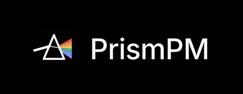

# Milestone 14 - Product name and logo

## Name

The product is called **PrismPM**.

“Prism” describes the product's central idea: one stream of messy project material enters the system and is separated into useful dimensions - Tasks, Evidence, Decisions, Assumptions, Risks and impact. “PM” makes the category immediately understandable as project management.

We considered keeping the earlier name **Vantage**, but PrismPM was clearer about the product category and matched the visual identity we had already built. Vantage suggested only a high-level view, whereas PrismPM emphasizes transforming project information into structured, traceable memory.

## Logo

The logo shows a beam entering a prism and separating into the six colors used by the product's tag palette. The beam represents raw project context; the separated colors represent the different but connected views that PrismPM gives a team. The geometric prism also communicates clarity, structure and seeing a Project from multiple angles.

The logo is implemented as a shared token-based SVG component and reused across the application, landing page and social preview. This keeps the brand consistent across surfaces and allows the social image to resolve the same design tokens during the build.

## Alternatives considered

| Name    | Why it was considered                                       | Outcome                                                                                          |
| ------- | ----------------------------------------------------------- | ------------------------------------------------------------------------------------------------ |
| Vantage | Our working name until 21 September; "a view from above"    | Replaced: it names a viewpoint but not the category, and not the transformation we perform       |
| PrismPM | One input, many structured outputs; "PM" names the category | Chosen; the rename kept existing sessions and tokens working (README, "Brand and compatibility") |
