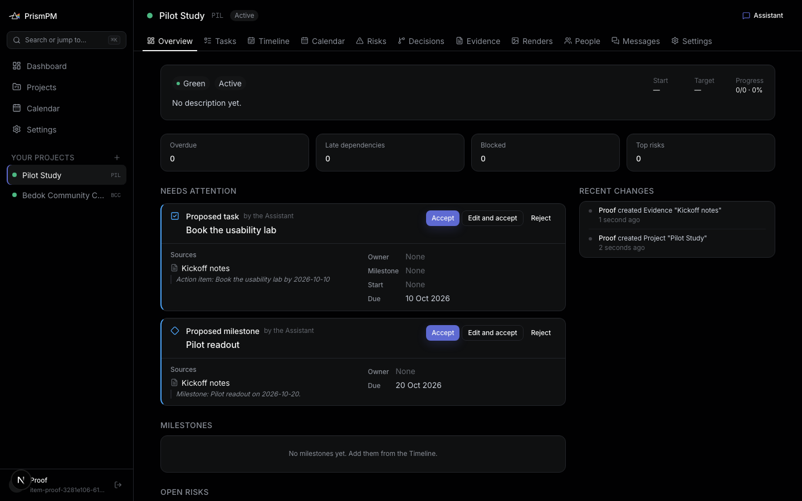
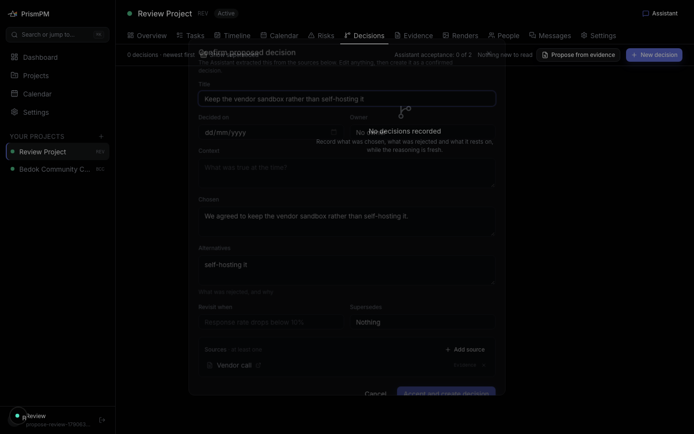
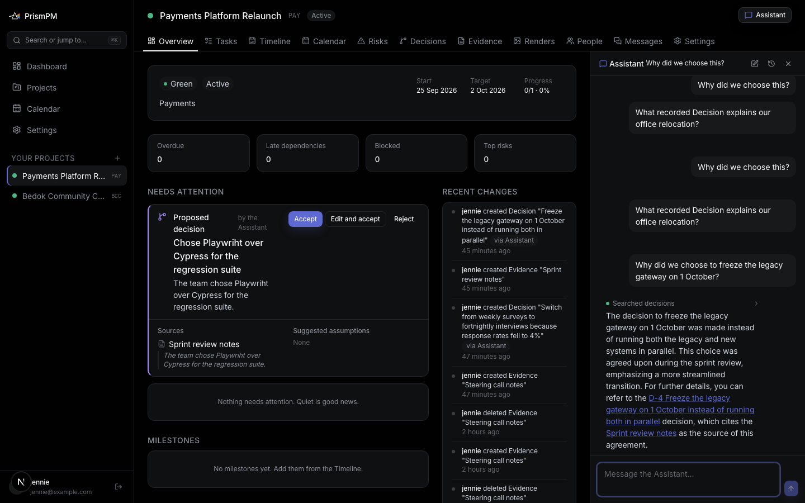
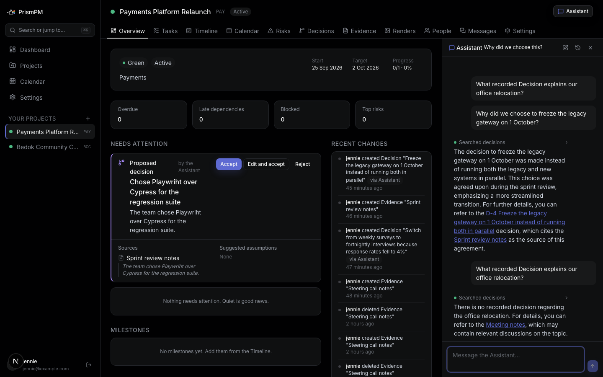
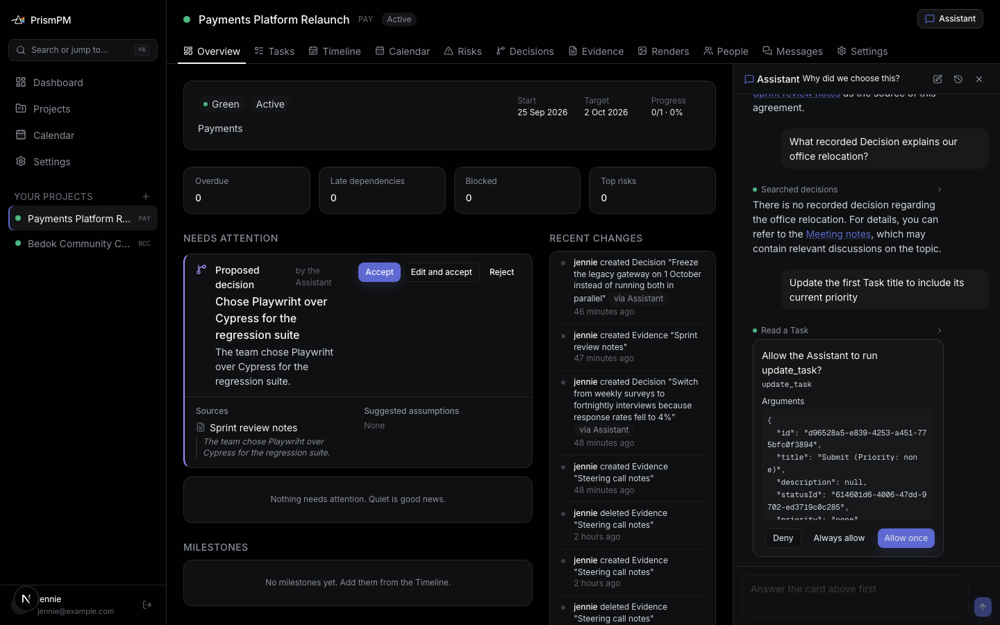
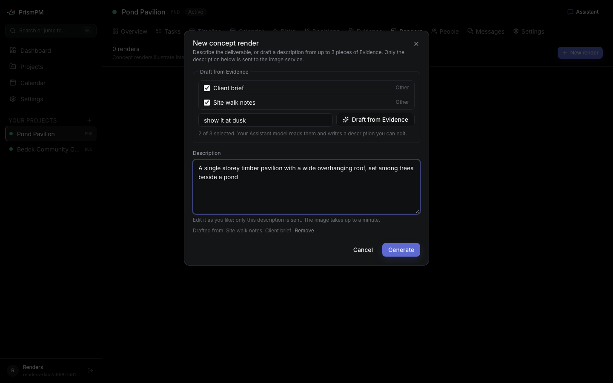
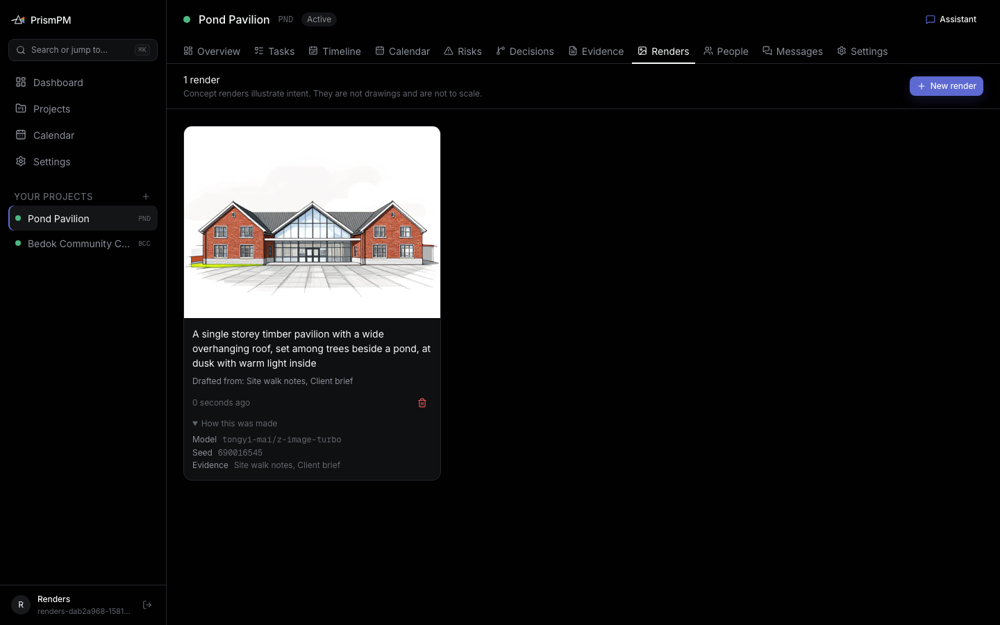
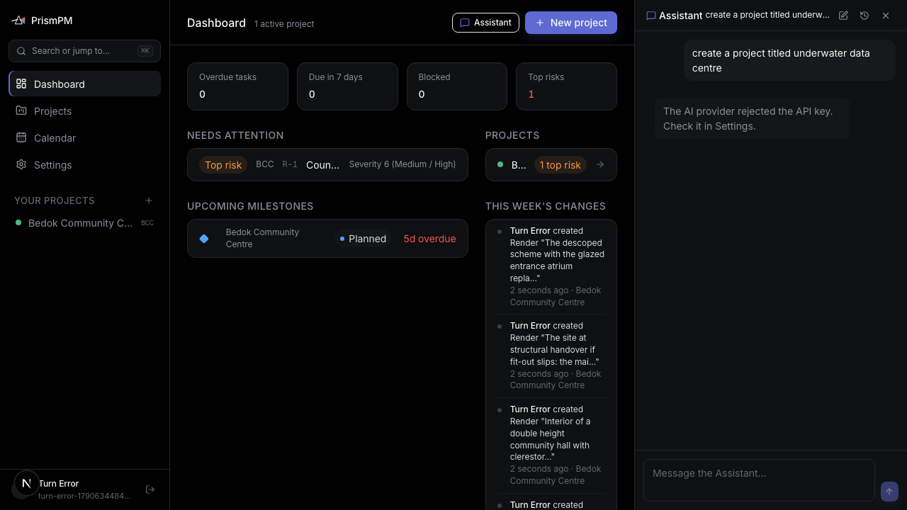

# Milestone 17 - UI decisions made for an AI application

PrismPM's AI can be wrong, can be manipulated by a document, and acts on data a team depends on.
Every decision below comes from one principle: **the PM must be able to see where an AI output came from, check it quickly, and stay the one who commits it.**
The guidelines we leaned on are Microsoft's _Guidelines for Human-AI Interaction_ (Amershi et al., CHI 2019) and Google PAIR's _People + AI Guidebook_; each decision names the guideline it applies.

## 1. Show the evidence next to every AI suggestion

A Proposal card shows the proposed item, the Source it came from and the **exact sentence quoted from that Source**, in italics under the Source name.
For a Task it also shows owner, Milestone and dates as separate fields, with "None" where the text named nothing, so an invented value is easy to spot.
Each card is labelled "Proposed milestone - by the Assistant".

_Why:_ HAX G11, "Make clear why the system did what it did".
A PM cannot judge a Proposal without its source, and re-opening the meeting notes to check takes minutes.
The excerpt is guaranteed verbatim by `trace.ts` (M10), so what the card quotes is really there.
We chose a quote over a confidence score: extraction models are poorly calibrated, and a percentage invites trust without giving the PM anything to check.

## 2. Three actions, not two: Accept, Edit and accept, Reject

_Why:_ HAX G9, "Support efficient correction".
Most Proposals are nearly right: the date is right but the owner is wrong.
With only Accept and Reject, a nearly right Proposal becomes a rejection plus a manual re-entry, which teaches the PM that the feature creates work.
**Edit and accept** opens the normal create dialog pre-filled, so correcting one field is one change.
The analytics event records `edited_before_accept`, so we can measure how often the model needed correcting (M19: 6 of 9 historical acceptances were edited).
When a stored Proposal no longer validates (its Milestone was deleted), the card says "Cannot be accepted as it stands; edit it first" rather than failing on click.

### Prototype: a dialog-first review (rejected)

Our first review flow opened each Proposal straight into the full Decision dialog from the Decisions tab.

It showed every field, but it made review modal and sequential, hid how many Proposals were waiting, and put the Source at the bottom of a long form.
The shipped cards on the Overview show all pending Proposals at once in **Needs attention**, with the Source on the card, and keep the dialog for the edit path only.

## 3. Show what the Assistant is doing, as it does it

The dock streams the answer and shows each tool call as a status line ("Searched decisions", "Read Evidence", "Created Milestone") that expands to its arguments and result.

_Why:_ HAX G11 ("Make clear why the system did what it did") and PAIR "Explainability + Trust".
A "why" answer is only trustworthy if it came from `search_decisions`; the status line lets the PM see that it did.
It also turns 2 to 5 seconds of silence (M12) into visible progress.

## 4. Citations are links that open the source in place

Every claim ends with a link to its Source; clicking opens that Evidence or Decision in a dialog without leaving the page.
Links are rendered only when `internalHref` accepts them as a real route inside this Project; an external, `javascript:` or placeholder link stays plain text.

_Why:_ PAIR "Explainability + Trust".
The dock is where the PM decides whether to believe the answer, so verifying must be one click.
Rendering only validated internal links means a model error (or an injected link) degrades to text instead of to a broken or malicious link; the eval harness grades every citation through this same function (M11).

## 5. Say "I don't know" in plain words

When no Decision is recorded, the answer is the fixed sentence "There is no recorded decision about that." followed by links to the nearest Evidence.

_Why:_ HAX G1 and G2, "Make clear what the system can do, and how well".
A fixed sentence is recognisable across answers, so a PM learns to read it as a boundary of the record rather than a failure.
Offering the nearest Evidence keeps the answer useful.

## 6. Approval cards name the exact change

Every write pauses at a card showing the tool and its arguments, with **Deny**, **Always allow** and **Allow once**.

### Prototype: Cancel / Confirm (replaced)

The first version (captured before the rename from Vantage) asked only for destructive tools, with **Cancel** and **Confirm**.
It was clear, but it left every other write unreviewed and offered no way to reduce friction for tools a PM trusts.
The trade-off we chose: approve **every** write by default (HAX G17, "Provide global controls"), and add **Always allow**, scoped to one tool in one Project and revocable in Settings, so friction falls only where the PM decides it should.
Destructive tools still carry a description naming the exact target ("Delete Task PM-12 'Write test plan'?").

## 7. Make the AI's memory visible and editable

Reflection rewrites a Profile for the User and a Working Memory for each Project after conversations.
Both are shown in Settings as Markdown the User can edit, with every version kept as a diff and a **Restore** button.

_Why:_ HAX G13, G16 ("Learn from user behavior", "Convey the consequences of user actions") and PAIR "Data Collection".
Hidden memory is the fastest way to lose trust: the Assistant starts acting on something the User never said.
Showing it as text, with history, lets the User see and correct what the model learned.

## 8. Keep data flow visible when text leaves for another service

The Render dialog says, at the top, "Only the description below is sent to the image service".
**Draft from Evidence** fills an editable textarea rather than generating directly, shows "Drafted from: Site walk notes, Client brief" with a **Remove** control, and each finished Render keeps a "How this was made" section with model, seed and Evidence.
Renders carry a standing caption: "Concept renders illustrate intent. They are not drawings and are not to scale."

_Why:_ PAIR "Data Collection + Evaluation" and HAX G11.
The image provider is a new, third party; a PM must see exactly what goes to it (ADR 0016).
The caption sets expectations so a generated concept is not mistaken for a design.
When no Assistant model is configured, the picker is disabled with "Connect an Assistant model in Settings to draft from Evidence" rather than hidden, so the capability is discoverable.

## 9. Failures stay in the thread, in words a PM can act on

A failed turn is stored in the conversation with a short, specific message ("The AI provider rejected the API key. Check it in Settings.") and survives a reload.

_Why:_ HAX G10 ("Scope services when in doubt") and PAIR "Errors + Graceful Failure".
Before this fix, a failed turn disappeared on reload and the User's question looked unanswered, which M19's analytics suggest happened to most questions in the week before the fix.
The provider's raw error is never shown, because it can echo the prompt.

## 10. Onboarding into a Project that already has memory

New Users get a seeded sample Project and a short guided tour.

_Why:_ PAIR "Mental Models".
The AI's value only appears once a Project has Evidence and Decisions; an empty workspace makes the Assistant look useless ("There is no recorded decision about that." to every question).
The sample Project lets the first question get a cited answer.

## 11. Output format matched to where it is read

An early prototype rendered Assistant text raw, so Markdown showed as `##` and `**`; the shipped dock renders headings, lists, code and quotes.

| Before                                                                     | After                                                              |
| -------------------------------------------------------------------------- | ------------------------------------------------------------------ |
|  |  |

The trade-off is prompt versus renderer: the Project prompt asks for plain text except citation links, because short answers read better in a narrow dock, but models do not always comply, so the renderer handles Markdown safely either way.
