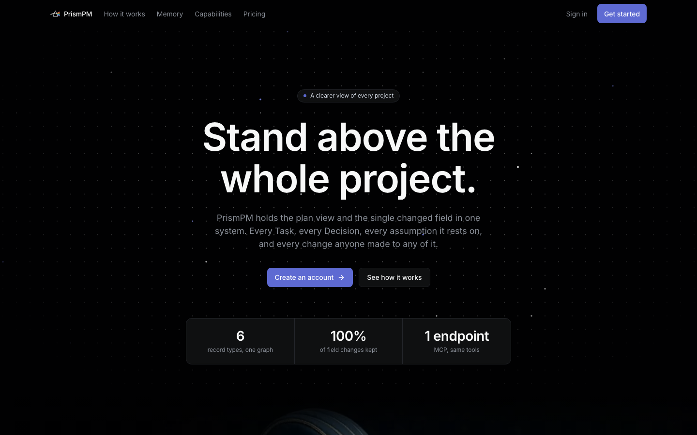
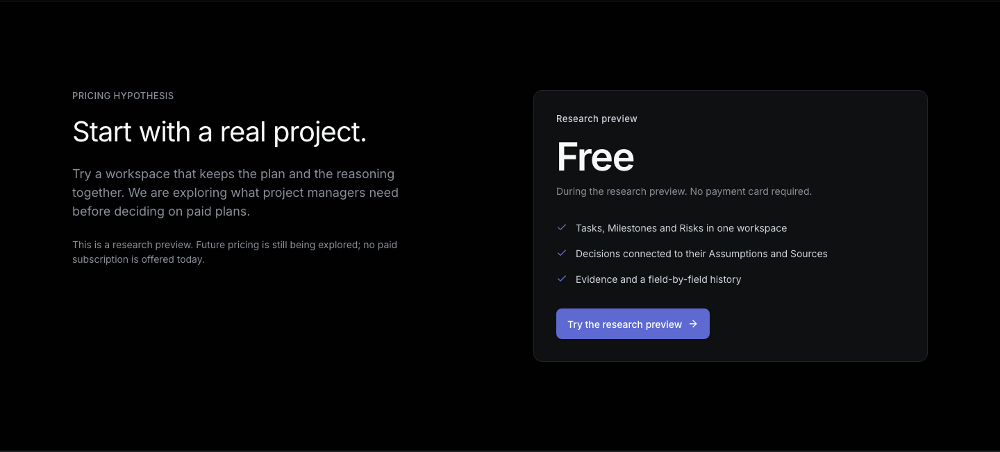
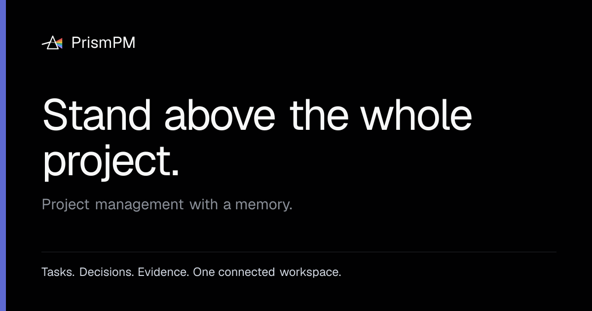
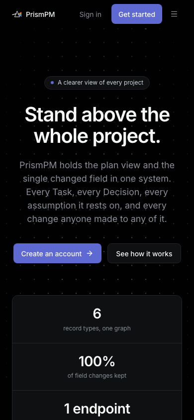

# Milestone 18 - Landing page

**Live:** https://jira-pro-max.vercel.app (the workspace is at `/dashboard`).
Checked against the deployment on 30 September 2026, which serves commit `34be9db`.

## Sections

| Section        | Content                                                                                                                                   |
| -------------- | ----------------------------------------------------------------------------------------------------------------------------------------- |
| Hero           | "Stand above the whole project.", the one-line value proposition, **Create an account** and **See how it works**, and three proof figures |
| How it works   | A five-chapter scroll film from raw project material to a structured plan, readable without JavaScript and with reduced motion            |
| Memory         | How a Decision keeps its Sources, Assumptions and supersession                                                                            |
| Capabilities   | Feature showcase with product screenshots (Overview, Tasks, mobile)                                                                       |
| Pricing        | The free research preview, labelled as a pricing hypothesis with no checkout implied (tiers under consideration are in M6)                |
| CTA and footer | Sign-up or, for a signed-in visitor, "Open your workspace"                                                                                |





## SEO

Verified on the live site:

- `<title>`, `meta description` and `robots: index, follow` on the landing page.
- `link rel="canonical"` to `https://jira-pro-max.vercel.app`, set from `SITE_URL` so previews do not compete with production.
- `robots.txt` allows `/` and disallows the private surfaces (`/dashboard`, `/projects`, `/calendar`, `/settings`, `/login`, `/signup`, `/invite/`, `/m/`, `/api/`), and points to the sitemap.
- `sitemap.xml` lists only the public landing page.
- Non-marketing pages carry `noindex`; Vercel preview deployments are crawl-suppressed.
- Semantic structure: one `h1`, labelled sections (`aria-labelledby`), descriptive link text.
- The local production build scored **100 SEO, 100 accessibility and 100 best practices** on both mobile and desktop in Lighthouse, with 88 performance on mobile and 100 on desktop ([reports](../artifacts/72-landing/lighthouse/)).

## Open Graph and social sharing

The live page serves:

```html
<meta property="og:title" content="PrismPM - project management with a memory" />
<meta property="og:description" content="Keep Tasks, Decisions and Evidence in one workspace. ..." />
<meta property="og:url" content="https://jira-pro-max.vercel.app" />
<meta property="og:image" content="https://jira-pro-max.vercel.app/opengraph-image" />
<meta property="og:image:width" content="1200" />
<meta property="og:image:height" content="630" />
<meta property="og:image:alt" content="PrismPM. Stand above the whole project. ..." />
<meta property="og:type" content="website" />
<meta name="twitter:card" content="summary_large_image" />
```

The image is generated at build time by `src/app/opengraph-image.tsx` from the same logo component and design tokens as the app, so the brand cannot drift between the product and its link previews.
`GET /opengraph-image` returns HTTP 200 `image/png`:



## Performance and resilience

- The hero poster is prioritised; the film loads deferred and has a static fallback when video fails or motion is reduced.
- The page works on a 390 px phone without horizontal scroll.



Earlier verification of the same page, including before and after screenshots and the SEO response dump, is in the [issue #72 report](../artifacts/72-landing/README.md).
