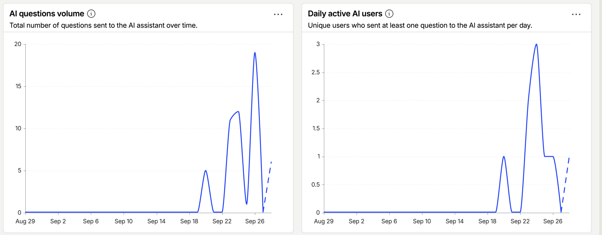
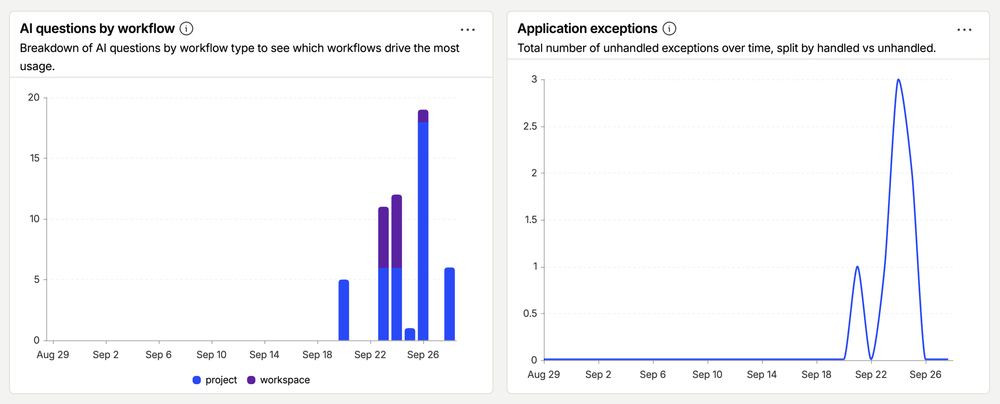
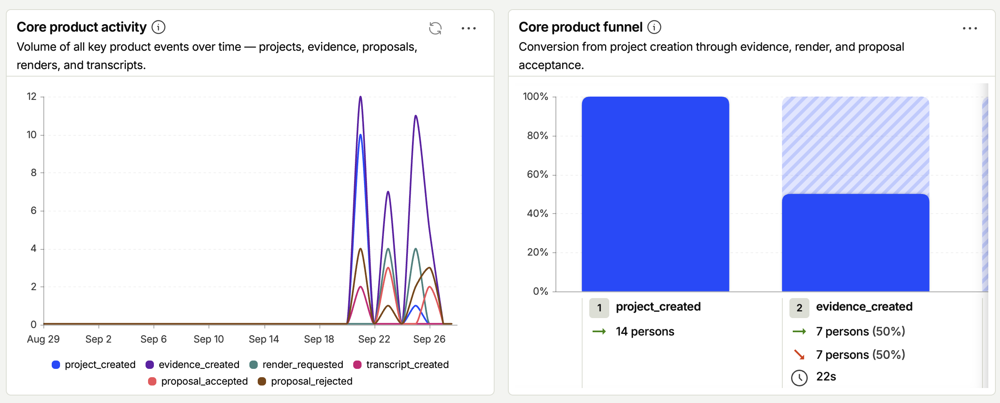
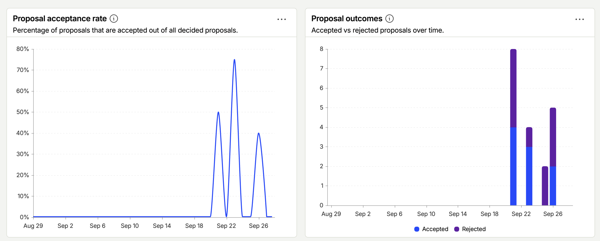

# M19 - Analytics Evidence

## Findings

PostHog project `618308` receives events from both the deployed app and local development.
The window is 29 August to 28 September 2026; the [audit](posthog-2026-09-28/README.md) holds the queries, raw exports and method.
Delivery works: a fresh deployed pageview reached PostHog, and in a local run the real browser and server SDKs reconciled event-for-event with the UI (6 of 7 browser scenarios passed; the seventh hit an unrelated Conversation error).
The sample is small and mixed, so these numbers describe exercised workflows, not adoption.

| Measure                       | Result                        | Read it as                                                                              |
| ----------------------------- | ----------------------------- | --------------------------------------------------------------------------------------- |
| Assistant questions           | 54 from 6 identities          | Peak 3 active in a day; a handful of testers, not a user base                           |
| Project / workspace questions | 42 / 12                       | 18 of the 42 came from one identity on 26 September                                     |
| Proposal decisions            | 9 accepted, 10 rejected       | 47.4% of decided Proposals, from 21 September; not split by extractor                   |
| Proposals generated           | 46 in 29 passes               | From 23 September; 38 heuristic, 8 model; a different set from the decided ones         |
| Model calls                   | 47, of which 27 errored       | All `AI_APICallError` (15 Assistant, 12 Reflection)                                     |
| Recorded model cost           | US$0.024 over 20 priced calls | The 27 errors here carry no tokens; not a billing figure                                |
| Browser exceptions            | 7, all unhandled              | Historical; under the current config a fresh browser captures no exceptions (see below) |

### Useful

- The failed model calls are the most actionable result: 27 of 47 calls, and likely most recent questions went unanswered (below).
  The error class alone does not say whether the cause is a key, model name or provider outage.
- Users exercised both outcomes of Proposal review, so the accept and reject paths are used, not just built.
- The event and property design is sound: every generation has a trace id, no prompt or answer content reached PostHog, and current outcome events carry the Proposal and extractor.

### Not trustworthy yet

- **Mixed environments.** 281 of 594 pageviews came from `localhost`, the internal/test cohort behind every "filter test accounts" toggle is empty, and server events carry no environment or release tag.
- **Early autocapture.** Until 22 September the browser SDK ran with default autocapture, so the window holds 361 `$autocapture` events, 56 dead clicks and 1 rage click, which may include on-screen text such as Project or Task titles.
  The Data safety section below describes the current configuration only.
- **The "Core product funnel" is wrong.** It requires a Render before a Proposal is accepted, which the product never requires, so it reads 14 to 7 to 0 to 0 while 9 acceptances happened outside it.
  Evidence, transcript and Render events also omit `project_id`, so no same-Project funnel can be built yet.
- **Coverage gaps.** Project, Evidence and Render events are captured in server actions, so Projects created by the Assistant or MCP `create_project` tool, and the sample Project seeded at signup, are not counted.
  Proposal and Assistant events are captured in services and the chat route, so they are counted whichever caller triggers them.
  `assistant_tool_approval` and `assistant_citation_opened` have no rows yet.
- **Question versus answer.** `assistant_turn_completed` first appears on 25 September.
  From then on there are about 26 questions but only 10 completed turns, and 10 plus the 15 failed Assistant calls is about 26, so most of those questions likely got no answer.
  This is arithmetic over daily totals, not a per-request match.
- **Model attribution.** Reflection and Proposal extraction always record the environment default model and provider, even when a User's personal model ran; the chat route does the same for failed calls.
  All 15 failed Assistant calls are labelled `gpt-4o-mini`, the default, so per-model error and cost figures are unreliable.
- **Exception coverage.** The browser SDK disables remote config and does not set `capture_exceptions`, so a fresh browser captures no exceptions; the 7 recorded ones came from older settings.
  The "Application exceptions" description also promises a handled/unhandled split that the query does not do.

### Next

1. Separate production from development (own project or an `environment` property on every event) and populate the test cohort.
2. Find and fix the cause of the failed model calls, then record the resolved model and provider on every span.
3. Set `capture_exceptions` explicitly and verify it in a fresh browser.
4. Add `project_id` to Evidence, transcript and Render events, and rebuild the funnel as Evidence to Proposal to Decision.
5. Re-measure over a defined external-user period, with outcomes split by extractor, before making product claims.

## Tool

PostHog (client `posthog-js`, server `posthog-node`).

## Integration

- `src/shared/analytics/provider.tsx` wraps the application root in `src/app/layout.tsx` and captures `$pageview` events on pathname changes.
- `src/shared/analytics/server.ts` exports `capture(userId, event, properties)` for server routes and `captureCurrent(event, properties)` for server actions.
- The server helper uses `next/server` `after()` to flush events after the response is sent.
- Browser identification, sign-out reset and real browser session propagation follow the [issue #73 contract](../artifacts/73-analytics-identity/README.md).
- Signup is captured once after identification; returning and restored sessions do not create signup events.
- Every server event carries `browser_context`, which is `browser` when the originating browser session correlates and `none` when there is none to correlate.
- The Evidence to Proposal to Decision funnel follows the [issue #74 contract](../artifacts/74-proposal-funnel/README.md): the transitions emit their own events, after the write.
- Automatic capture and replay are disabled (since 22 September); credential routes are suppressed and URL query/hash content is removed.

## Required environment variables

| Variable                   | Source  | Value                      |
| -------------------------- | ------- | -------------------------- |
| `NEXT_PUBLIC_POSTHOG_KEY`  | PostHog | Project API key            |
| `NEXT_PUBLIC_POSTHOG_HOST` | PostHog | `https://us.i.posthog.com` |

## Event definitions

| Event name                  | When captured                                                                      | Explicit properties (no business content)                                                                                                                                                                                                                       |
| --------------------------- | ---------------------------------------------------------------------------------- | --------------------------------------------------------------------------------------------------------------------------------------------------------------------------------------------------------------------------------------------------------------- |
| `$pageview`                 | Every client-side route change                                                     | `$current_url`                                                                                                                                                                                                                                                  |
| `signup_completed`          | After successful email or new-account OAuth sign-up                                | None (SDK User/session context)                                                                                                                                                                                                                                 |
| `login_completed`           | After a successful sign-in to an existing account                                  | None (SDK User/session context)                                                                                                                                                                                                                                 |
| `project_created`           | After `createProjectAction` succeeds                                               | `project_id`                                                                                                                                                                                                                                                    |
| `evidence_created`          | After `createEvidenceAction` succeeds                                              | `evidence_id`, `evidence_kind`                                                                                                                                                                                                                                  |
| `transcript_created`        | After Evidence of kind `transcript` is created                                     | `evidence_id`                                                                                                                                                                                                                                                   |
| `render_requested`          | After a concept render is requested                                                | `render_id`, `evidence_count` (Evidence the description was drafted from, 0 when typed)                                                                                                                                                                         |
| `proposal_generated`        | After a pass commits at least one Proposal, automatic or requested                 | `project_id`, `trigger`, `extractor`, `proposal_count`, `source_count`, `evidence_source_count`, `comment_source_count`, `discarded_count`                                                                                                                      |
| `proposal_accepted`         | After the transaction that turns the Proposal into a Decision commits              | `project_id`, `proposal_id`, `extractor`, `edited_before_accept`                                                                                                                                                                                                |
| `proposal_rejected`         | After a pending Proposal is marked rejected                                        | `project_id`, `proposal_id`, `extractor`                                                                                                                                                                                                                        |
| `item_proposal_generated`   | After an item pass commits at least one Task or Milestone Proposal                 | `project_id`, `trigger`, `extractor`, `task_count`, `milestone_count`, `source_count`, `discarded_count`                                                                                                                                                        |
| `item_proposal_accepted`    | After the transaction that turns an item Proposal into a Task or Milestone commits | `project_id`, `proposal_id`, `kind`, `extractor`, `edited_before_accept`                                                                                                                                                                                        |
| `item_proposal_rejected`    | After a pending item Proposal is marked rejected                                   | `project_id`, `proposal_id`, `kind`, `extractor`                                                                                                                                                                                                                |
| `assistant_question_sent`   | When the User sends a new message to `/api/assistant/chat`                         | `workflow` (`project` or `workspace`)                                                                                                                                                                                                                           |
| `assistant_tool_approval`   | After a turn that carried the User's answer to a write-tool approval card          | `workflow`, `tool`, `approved` (the User's answer, not whether the tool ran)                                                                                                                                                                                    |
| `assistant_turn_completed`  | When an Assistant turn finishes streaming                                          | `workflow`, `conversation_id`, `step_count`, `tool_call_count`, `tool_names`, `finish_reason`, `hit_step_cap`, `latency_ms`, `input_tokens`, `output_tokens`, `$ai_trace_id`                                                                                    |
| `assistant_limit_reached`   | When the daily turn cap returns 429                                                | `workflow`, `daily_turn_cap`                                                                                                                                                                                                                                    |
| `assistant_citation_opened` | When the User clicks a cited link in an Assistant answer                           | `citation_kind` (a Project section such as `decisions`, `tasks`, `overview`, else `other`)                                                                                                                                                                      |
| `$ai_generation`            | After every model call, success or failure (see below)                             | `$ai_span_name`, `$ai_trace_id`, `$ai_model`, `$ai_provider`, `$ai_latency`, `$ai_input_tokens`, `$ai_output_tokens`, `$ai_cache_read_input_tokens`, `$ai_reasoning_tokens`, `finish_reason`, `$ai_is_error`, `$ai_error`, plus the span's own properties below |

`impact_graph_opened` is read from `$pageview` on `/projects/*/graph`, so it needs no event of its own.
`assistant_abstained` and `impact_alert_viewed` are not captured.

## LLM analytics

`src/shared/analytics/ai.ts` records every model call as a PostHog `$ai_generation` event, which PostHog's LLM Analytics view turns into cost, latency and token dashboards per model.
The five call sites are distinguished by `$ai_span_name`:

- `assistant_turn`: one event per model call in `/api/assistant/chat`, with `workflow`, `conversation_id` and `step`, grouped per request by `$ai_trace_id` and summarised by `assistant_turn_completed`.
  A provider failure, before or during the stream, is recorded; a tool or approval error is not a generation and is not.
  `hit_step_cap` is true only when the last allowed step still asked for tools.
- `proposal_extraction`: the `generateObject` call of a model Proposal pass, with `project_id`, `trigger` and `source_count`.
- `item_extraction`: the second `generateObject` call of the same pass, proposing Tasks and Milestones (#114), with the same properties.
- `reflection`: the `generateObject` call that rewrites the Profile and Working Memory, with `conversation_id` and `project_id`, under the `$ai_trace_id` of the Assistant turn that triggered it.
- `render_draft`: the `generateText` call that drafts a Render description from Evidence (#117, ADR 0016), with `project_id` and `evidence_count`.

Failures are recorded with `$ai_is_error: true` and the error class name only, since a provider message can echo the prompt.
A structured-output mismatch keeps the tokens it spent.
For the `generateObject` and `generateText` spans, `$ai_latency` covers the whole call, including any retries the SDK makes after a provider error.
`$ai_provider` is the provider family (`openai`), not the SDK's per-API name (`openai.responses`).
`$ai_input` and `$ai_output_choices` are never sent, so no prompt, Evidence text or answer reaches PostHog.

The Proposal funnel rows were verified on branch `fix/auth` against a local collector with the real browser and server SDKs; see [the funnel artifact](../artifacts/74-proposal-funnel/README.md) for the run and its reconciliation.
The [28 September audit](posthog-2026-09-28/README.md) verifies historical events in the actual PostHog project and a fresh deployed landing pageview.
It does not certify a fresh authenticated production funnel or a deployed release SHA; local real-SDK reconciliation and historical production-project observations remain distinct evidence.

## Data safety

No raw evidence text, transcripts, prompts, names, emails, or project titles are sent.
Explicit custom properties contain internal ids and bounded metadata; internal ids are not necessarily hashed.
The browser SDK also supplies technical browser, host, and session metadata, and PostHog may enrich events.
These are pseudonymous analytics, not a claim of anonymous or metadata-free collection.

## Dashboard checklist

- [x] Confirm the deployed browser sends to PostHog project `618308`; a fresh pageview was received on 28 September 2026.
- [ ] Trigger every defined event in controlled authenticated production flows and reconcile it with the deployed release; historical coverage and a fresh anonymous pageview are verified.
- [x] Inspect saved AI usage and core product dashboards, including Project counts, Proposal outcomes, and question volume.
- [ ] Add or verify a signup funnel and top-pages view, and correct the general product funnel.
- [x] Query `$ai_generation` for Assistant, extraction, and Reflection spans; cost and token coverage exists for 20 of 47 calls, with limitations recorded in the audit.
- [ ] Add insights for tool approval rate (`assistant_tool_approval` by `approved`), turns hitting the step cap and `assistant_limit_reached` (M13, M17).
- [x] Preserve and embed all four supplied dashboard screenshots with checksums and query context.
